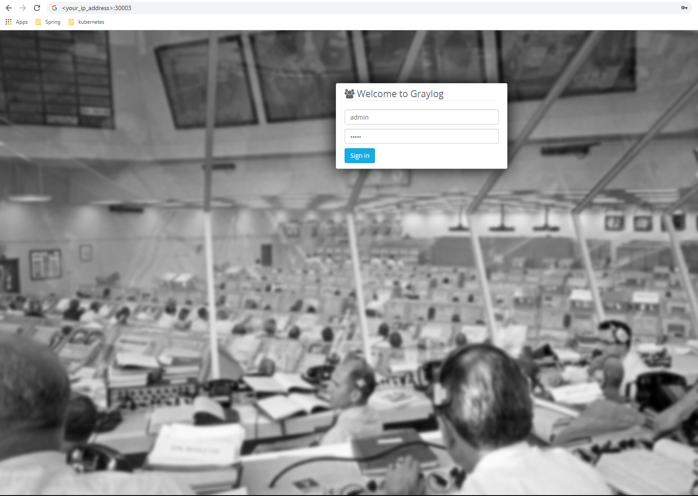
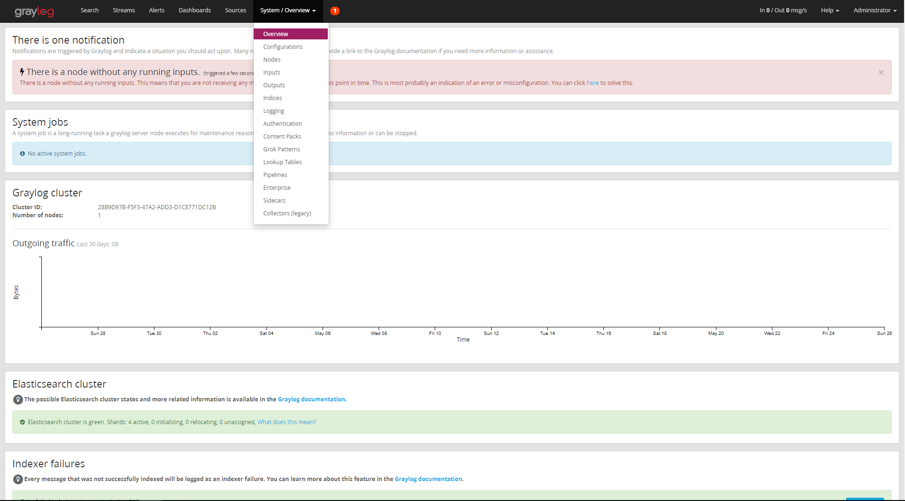
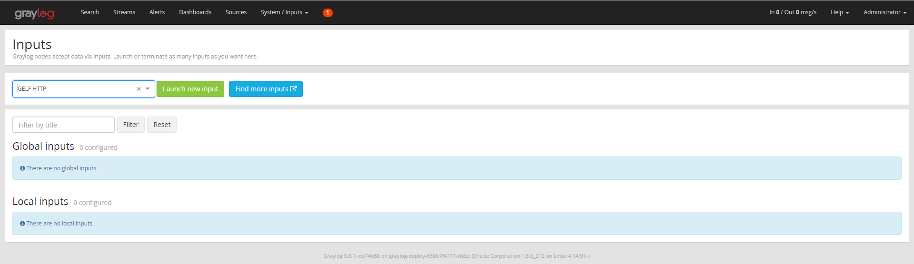
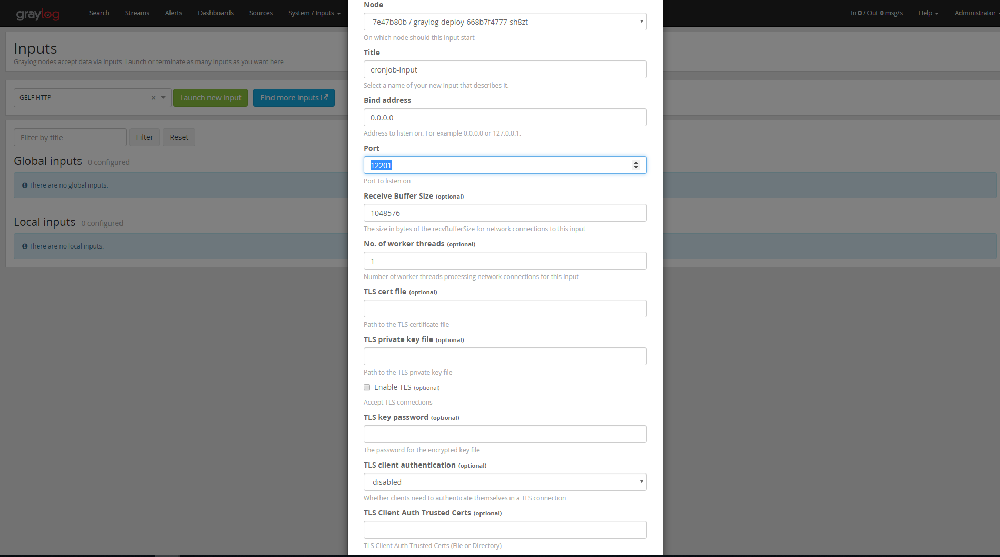
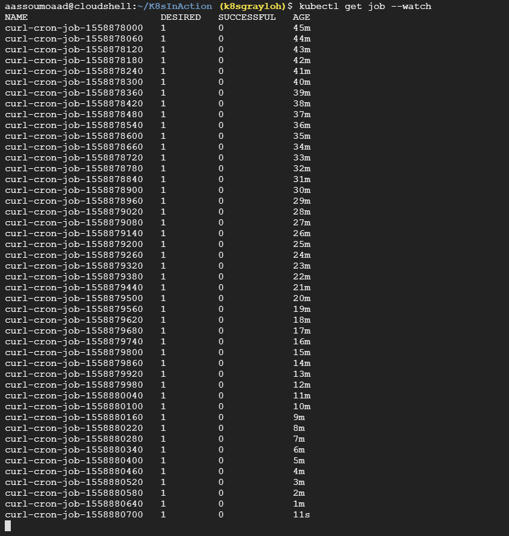
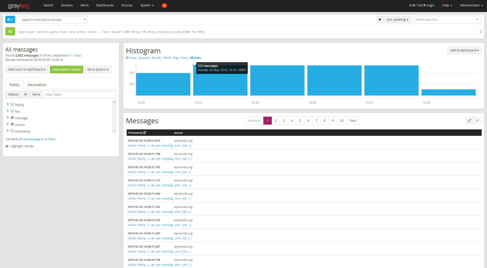
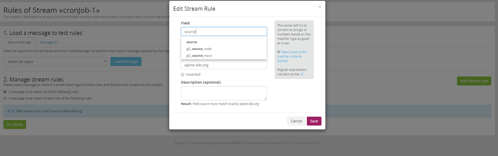
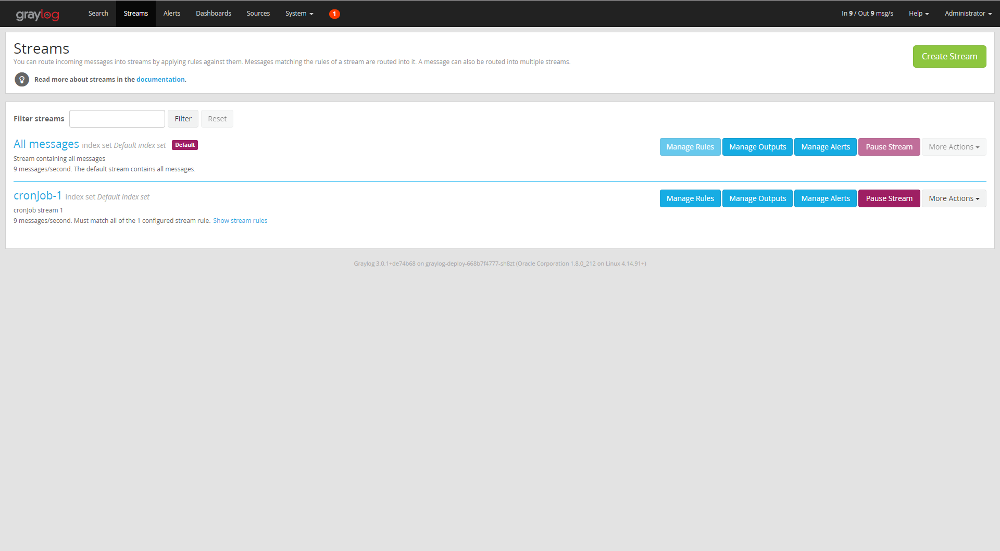
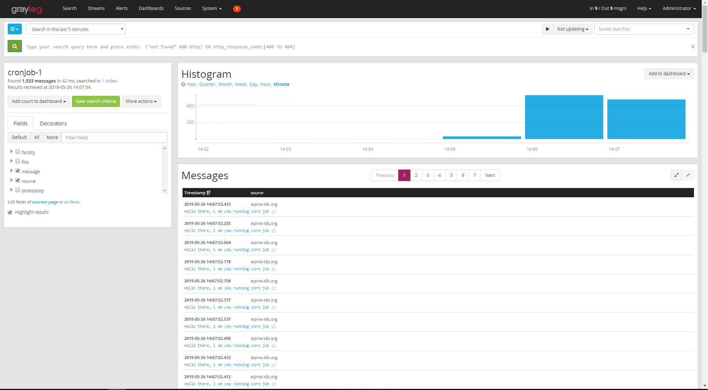

# Graylog with Kubernetes and GKE
<br/><br/>

## Introduction
all know that collecting data - Logs, ... - from different data sources - whether it is an application, server, service, ... -
is a necessity to have a better tracking system that tells what went wrong with your system at a specific time, also to know exactly 
how your system behave.
Here Comes Graylog to do the job, collecting data from different sources, creating dashboards, streams, and also 
behave gain as data source in case you created a Graylog output  

## Article Goal :

This project aims to demonstrate how to deploy The Graylog Stack - Graylog v3, Elasticsearch v6 along with MongoDB v3 - using Kubernetes, 
and how to collect data from different data sources using inputs, and use the stream & outputs.

## What is Graylog :
Graylog is a leading centralized log management solution built to open standards for capturing, storing, and enabling real-time analysis
of terabytes of machine.  it supports the Master-Slave Architecture

Graylog is very flexible in such a way that it supports multiple inputs (data sources : by this this i mean how Graylog nodes will accept data) 
we can mention 
- GELF TCP.
- GELF Kafka. 
- AWS Logs. 

as well as Output (how can Graylog nodes forward messages) - we can mention :  
- GELF Output.
- STDOUT.

> !! you can visit [Grylog Marketplace](https://marketplace.graylog.org/) for detail !!

You can route incoming messages into streams by applying rules against them. Messages matching the rules of a stream are routed into it.
A message can also be routed into multiple streams.

## Scenario
In this article, we gonna create a kubernetes cron job which will be used as data source for Graylog, this data source
will send message to the Graylog pod every 2 seconds. then we gonna create a stream to hold these message.

the advantage of this approach is that you can collect data from multiple data source and each one get its stream - each message stream -
so for example a stream for data that comes from AWS EC2 instances, or your Application - which we will discover in a another article.

#### Pre-requisites:
* GKE clsuter, Google gives you an account with 300$ for free.
* or you can use minikube, for that you have to adjust the elasticsearch manifest, so that you shouldn't use
affinity so that the elasticsearch service can start.
<br/>
<br/>

> you can create an account in [Google Cloud](https://cloud.google.com/free) so that you get $300 credit.
this credit - $300 - is only used when you exceed free usage limits. Credit expires in 12 months.
## setting up the  project on your cluster
#### cloning the project
you can use my project from github [Repository](https://github.com/mouaadaassou/K8s-Graylog) :
```
    git clone https://github.com/mouaadaassou/K8s-Graylog.git
```

#### Explaining the Graylog Stack Deployments:

To deploy Graylog, you need to run Elasticsearch along with MongoDB, but the question is why both of them. 

the reason behind this requirement is as follow: 
* Graylog uses MongoDB to store your configuration data, not your log data. Only metadata is stored, such as user information or stream configuration

* Graylog uses Elasticsearch to store the logged data, as we know Elasticsearch is powerful search engine . it is recommended to use a dedicated Elasticsearch cluster for your Graylog setup. 

So you have to first deploy Elasticsearch and MongoDB so that the Graylog can start. 
#### Explaining the Corn Job
to simulate a data source that sends some data to be logged to Graylog, we creat a Kubernetes Core Job
that will be running every 2 seconds. and it uses curl to post the message to Graylog.
```
apiVersion: batch/v1beta1
kind: CronJob
metadata:
  name: curl-cron-job
spec:
  schedule: "* * * * *"
  jobTemplate:
    spec:
      template:
        spec:
          containers:
          - name: curl-job
            image: alpine:3.9.4
            args:
            - /bin/sh
            - -c
            - apk add curl -y; while true; do curl -XPOST http://graylog3:12201/gelf -p0 -d '{"short_message":"Hello there", "host":"alpine-k8s.org", "facility":"test", "_foo":"bar"}';sleep 1s; done
          restartPolicy: OnFailure
```

#### Configuring Graylog deployment
you have to customize the GRAYLOG_HTTP_EXTERNAL_URI value so that it points to your local or remote host

```
  - name: GRAYLOG_HTTP_EXTERNAL_URI
    value: #your_remote_or_localhost_ip
```

you can also change the default password to login to the Graylog web interface, to do so you have to run the following 
command into your terminal

```
echo -n "Enter Password: " && head -1 </dev/stdin | tr -d '\n' | sha256sum | cut -d" " -f1

```

this command will ask you to enter your password, then copy past the generated hashed password to the environment variable :

```
  - name: GRAYLOG_ROOT_PASSWORD_SHA2
    value: generated_hashed_password_here
```

you can check the Graylog config file [graylog.conf](https://github.com/Graylog2/graylog2-server/blob/master/misc/graylog.conf) for more details.

#### Deploying th Graylog stack :
in order to deploy the stack, you create a kubernetes deployment as follow :
```
kubectl create -f es-deploy.yaml
kubectl create -f mongo-deploy.yaml
kubectl create -f graylog-deploy.yaml
``` 
 
 you can check the deployment using the following command :
```
 kubectl get deploy
```
 
 also you can check the pods created by this deployments :
```
 kubectl get pods
```
 
#### Login to Graylog web interface :
after running Graylog stack you can login to Graylog web interface as follow:
<br/><br/>

> change <your_ip_address> by yours

#### Creating a Gelf HTTP Input
after login we have to create an input to receive the messages from the cron job.
to do so you can go to : System -> Input 

<br/>
then select Gelf Http and click Launch new input:

<br/>
after that a form box will ask you to specify the node, bind address and port as follow :

</br>


#### Creating the Corn Job
know everything is setup, our Graylog input is running, so we have to start our data source
to log messages to the Graylog instance.

launch the K8s cron job using the following command
```
kubectl create -f cornJob.yaml
```
to display the cron job details use the following command
```
kubectl get job --watch
```


#### Checking the received Logs from CronJob:
Now everything should work fine, the Graylog Stack, CronJob.
we have just to check the received message as follow : click on Search



#### Creating a Separate Stream for CronJob messages:
until now, we did a great job, we have everything we need.
but in case that we have multiple inputs, and all of them put the messages to the All-Messages stream,
we will get some messy, so it will be difficult to know which input has send this message without 
filtering. at this is moment think about creating you own stream.

To create a stream for that specific input, Go to Streams, click on Creat Stream button
and fulfil the form as follow :


 
press Save, in my case i named this stream 'crinjob-1'.
after that we have to manage rules - we should tell graylog which messages
should be in our stream.

click Manage Rules -> Add stream rule, then fulfil the form as follow :


>in my case, i am telling graylog to put the message received by "source"="alpine-k8s.org" in the created stream.

press Save, and Go Streams, you will list all the existing streams :


> as you can see, our stream cronjob-1 has been created, click on it, and you will see
all the messages from the source alpine-k8s.org which is our running cron job



#### Where to Go
Graylog is a very flexible, it support different data soure inputs, you can creat streams and attach it to a given input/output, ...
after this article, you are able to start your own Gaylog Stack and log data to it,
for further information about Graylog, you take a look at the [Official Documentation](https://docs.graylog.org/en/3.0/)

next article we gonna use Graylog with Spring Boot Application to demonstrate how
send our Application logs to Graylog and how to create a Dashboard for this specific application 
to visualize the metrics. looking forwards :).
  
## Q/A
### Why Elasticsearch version 6 and not version 7 ?
Graylog v3 support only Elasticsearch version 6 - as a major version. so you cannot use Elasticsearch 7 - at least at the time of writing, 
but you can check the Grayog Documentation for further information.

### how to generate an admin password:
you can generate a hashed password using the following command, but first you have to install sha256sum : 

```
echo -n "Enter password" && head -1 </dev/stdin | tr -d '\n' | sha256sum | cut -d" " -f1
```

